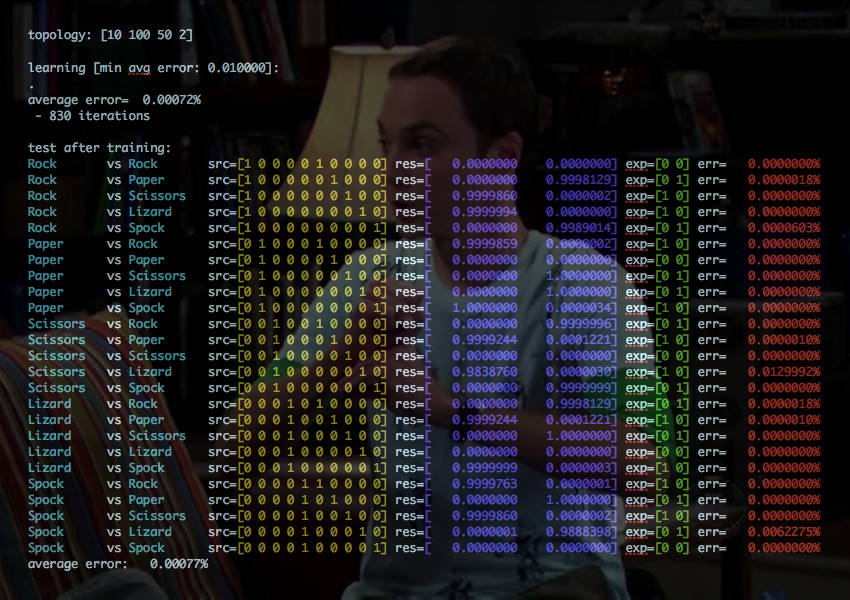

# godnn
Deep Neural Network package written in Go programming Language

Installation
-----------

	go get github.com/syndtr/goleveldb/leveldb
	
Documentation
-----------

This package is very simple:

1. Import the package

       import "github.com/xigh/godnn"

2. Create a network instance

       net, err := dnn.Create([]int{ 6, 12, 2 })

where parameter to dnn.Create is the topology of your neural network layer (ie the number of neuron per layer). First layer is the input, last layer is the output.

3. Train your network:

       dist, err := net.Train(input, output, eta, alpha)

where input is the input vector, output is the expected result to converge to, eta is learning rate. It returns the average error.

4. Ask you network to predict and answer:

       res, err := net.Predict(input)

It returns the output ...

Disclaimer
-----------

I'm not a AI researcher. I mean I've not studied AI at school, but I often use it at <http://mediawen.com>. This is the reason why I wrote this small [IBM Watson SDK in Go](https://github.com/Mediawen/watson-go-sdk).

I watched the Prof Patrick Henry Winston course at [MIT Open Courseware](http://ocw.mit.edu/courses/electrical-engineering-and-computer-science/6-034-artificial-intelligence-fall-2010/index.htm) along with Yann Lecun videos here and there (especially the course at [Collège de France](http://www.college-de-france.fr/site/yann-lecun/course-2016-02-12-14h30.htm).

With this DNN package, I want to learn more how DNN works. My goal is to use it inside our tools we develop for STVHub, our subtitling platform...

Todo
-----------

Testing.
Better doc.
Make it more configurable (threshold function, ...).
Make it more scalable.
Make some benchmarks.
Add more examples (train it with MNIST DATABASE)
Try RNN (Recurrent Neural Network) with LSTM (Long short-term memory) architecture.
Learn, learn, study and learn...

Example
-----------

As funny example, I trained this DNN to learn Rock-Paper-Scissors-Lezard-Spock. You can find the rules in Big Bang Theory serie Episode 8, Season 2. Here is the result:

License
-----------

Copyright (c) 2016, Philippe Anel
All rights reserved.

Redistribution and use in source and binary forms, with or without
modification, are permitted provided that the following conditions are met:

* Redistributions of source code must retain the above copyright notice, this
  list of conditions and the following disclaimer.

* Redistributions in binary form must reproduce the above copyright notice,
  this list of conditions and the following disclaimer in the documentation
  and/or other materials provided with the distribution.

THIS SOFTWARE IS PROVIDED BY THE COPYRIGHT HOLDERS AND CONTRIBUTORS "AS IS"
AND ANY EXPRESS OR IMPLIED WARRANTIES, INCLUDING, BUT NOT LIMITED TO, THE
IMPLIED WARRANTIES OF MERCHANTABILITY AND FITNESS FOR A PARTICULAR PURPOSE ARE
DISCLAIMED. IN NO EVENT SHALL THE COPYRIGHT HOLDER OR CONTRIBUTORS BE LIABLE
FOR ANY DIRECT, INDIRECT, INCIDENTAL, SPECIAL, EXEMPLARY, OR CONSEQUENTIAL
DAMAGES (INCLUDING, BUT NOT LIMITED TO, PROCUREMENT OF SUBSTITUTE GOODS OR
SERVICES; LOSS OF USE, DATA, OR PROFITS; OR BUSINESS INTERRUPTION) HOWEVER
CAUSED AND ON ANY THEORY OF LIABILITY, WHETHER IN CONTRACT, STRICT LIABILITY,
OR TORT (INCLUDING NEGLIGENCE OR OTHERWISE) ARISING IN ANY WAY OUT OF THE USE
OF THIS SOFTWARE, EVEN IF ADVISED OF THE POSSIBILITY OF SUCH DAMAGE.
